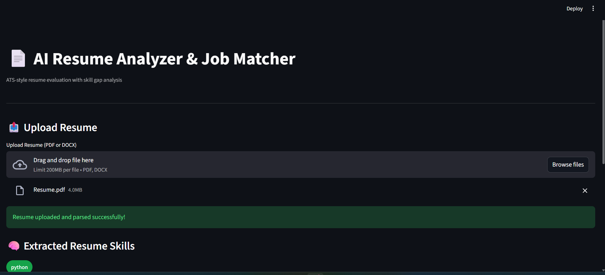
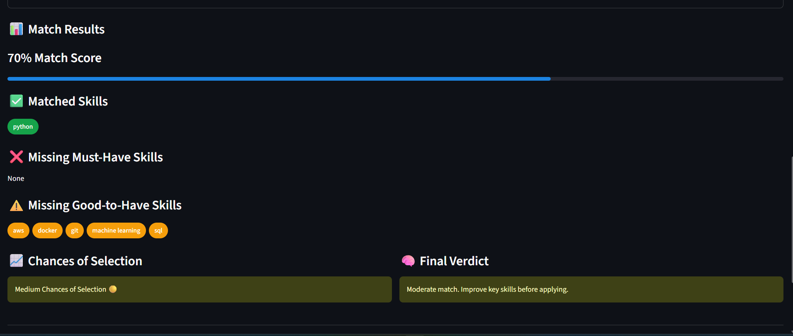
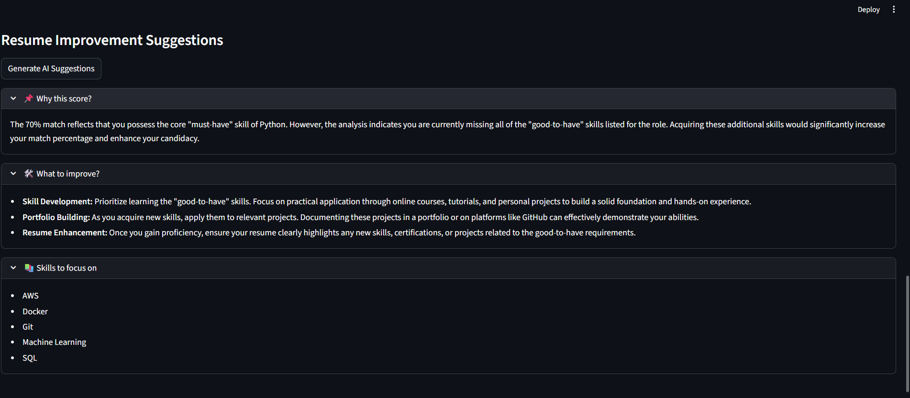

# 📄 AI Resume Analyzer & Job Matcher

An ATS-style web application that analyzes resumes against job descriptions, calculates a match score, identifies skill gaps, and provides actionable improvement suggestions.

Built with **Python**, **Streamlit**, and **NLP techniques**, this project focuses on explainability, ethical AI usage, and real-world hiring workflows.

---

## 🚀 Features

- 📤 Upload resume (PDF / DOCX)
- 🧠 Extract skills using NLP & rule-based logic
- 📄 Analyze job description requirements
- 📊 ATS-style weighted match scoring
- 🏷️ Visual skill chips (matched & missing skills)
- 🎯 Chances of selection indicator
- 🤖 AI-powered resume improvement suggestions (Gemini)
- 🌙 Clean dark-mode UI
- ☁️ Ready for cloud deployment

---

## 🧠 How It Works

1. Resume is uploaded and parsed
2. Skills are extracted and normalized
3. Job description skills are identified
4. Resume ↔ Job matching is performed using weighted logic
5. Match score, gaps, and recommendations are shown

---

## 🛠️ Tech Stack

- **Language:** Python  
- **Framework:** Streamlit  
- **NLP:** Rule-based skill extraction + text preprocessing  
- **AI:** Gemini API (recommendation layer only)  
- **Version Control:** Git & GitHub  

---

## 📸 Screenshots

### 🔹 Resume Upload


### 🔹 Job Description & Skill Extraction


### 🔹 Match Results & Skill Gaps


### 🔹 AI Resume Suggestions


---

## ▶️ Run Locally

```bash
git clone https://github.com/anand-cml40/ai-resume-analyzer.git
cd ai-resume-analyzer
pip install -r requirements.txt
streamlit run app.py


GEMINI_API_KEY=your_api_key_here

📌 Disclaimer

This tool provides guidance and insights only.
It does not guarantee job selection and should be used as a decision-support system.

👤 Author

Anand Sonsali
Python Developer | AI & NLP Enthusiast

